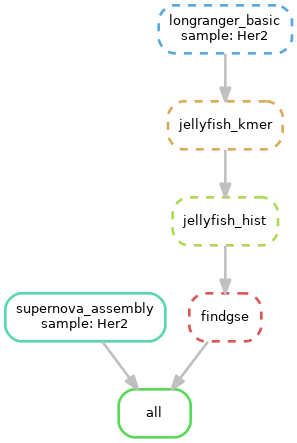

========================================
Snakemake pipeline for de novo genome assembly using a combination of long and short read sequencing data (ONT + 10x Illumina + HiFi PacBio Isoseq + Bionano OpticalMap)
========================================

.. contents:: **Table of Contents**

Linked reads Illumina (10x)
========================================

(1) Performing supernova assembly of 10x data - assemble de novo genome (recommended 45-56x genome coverage) \
(2) Performing longranger basic pipeline - extracts and trims long-molecule barcodes \
(3) k-mer based genome metrics (fastq output of longrange basic) \

